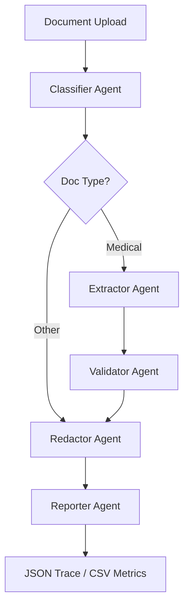

# Prototype 2: Agentic AI Document Processor (Local)

> **Agentic medical document intelligence pipeline (Local) powered by LangGraph, AWS Bedrock, and Groq.**

[](https://www.python.org/downloads/)
[](https://github.com/langchain-ai/langgraph)
[](https://aws.amazon.com/bedrock/)
[](https://groq.com/)

## 📋 Table of Contents
- [Overview](#overview)
- [Key Features](#key-features)
- [Architecture](#architecture)
- [Tech Stack](#tech-stack)
- [Installation](#installation)
- [Usage (CLI & API)](#usage-cli--api)
- [Responsible AI Logging](#responsible-ai-logging)
- [Error Handling & Fallbacks](#error-handling--fallbacks)
- [Evaluation Metrics](#evaluation-metrics)
- [Testing](#testing)

## 🎯 Overview

This project implements a **local agentic pipeline** for Prototype 2, specialized in medical document intelligence. The system ingests local documents (PDFs/Text) and performs automated classification, extraction, clinical validation, and HIPAA-compliant redaction using **LangGraph** orchestration and **Amazon Bedrock**.

## ✨ Key Features

- **Agentic Multi-Agent Pipeline**: Specialized agents for Classification, Extraction, Validation, Redaction, and Reporting.
- **Dynamic LLM Routing**: Native support for **Amazon Bedrock (Claude 3 Haiku / Titan)**, **Groq (Llama 3)**, and **Ollama**.
- **Clinical Intelligence**:
    - **Extraction**: Structured clinical data (Doctor, Patient, Meds, Lab results).
    - **Validation**: Strict regex enforcement for IDs/Licenses + domain logic (DEA checks, pediatric weight alerts, critical lab values).
- **HIPAA Compliance**: Automated PII masking with dynamic trace logging for auditability.
- **Responsible AI Traceability**: Per-agent decision logs storing input/output and reasoning.

## 🏗️ Architecture



## 🛠️ Tech Stack

- **Orchestration**: LangGraph (Stateful graph-based agents)
- **Framework**: LangChain (boto3 for Bedrock, tenacity for retries)
- **Primary LLM**: Amazon Bedrock (Claude 3 Haiku)
- **Fallback LLM**: Amazon Titan Text / Groq Llama 3
- **Validation**: Pydantic v2 + JSON-Schema
- **Frontend**: Streamlit (Processing Interface)
- **API**: FastAPI (High-performance endpoints)

## 🚀 Installation

### Prerequisites
- Python 3.10+
- AWS Credentials (for Bedrock) or Groq API Key

### Setup
```bash
# Clone and enter repo
git clone <repo-url>
cd ragagent

# Setup virtual environment
python -m venv .venv
source .venv/bin/activate  # Windows: .venv\Scripts\activate

# Install requirements
pip install -r requirements.txt

# Environment config
cp .env.example .env
# Configure AWS_ACCESS_KEY_ID, AWS_SECRET_ACCESS_KEY, and AWS_REGION
```

## 💻 Usage (CLI & API)

### 1. Unified CLI (Batch Runs)
```bash
python run_cli.py "data/samples/" --provider bedrock
```

### 2. Streamlit Interface (Visual Processing)
```bash
python run.py  # Launches both API and UI
```

## 📊 Responsible AI Logging

The system generates a **Decision Trace** for every process:
- **Trace Report (JSON)**: `reports/trace_*.json` - Full audit trail (Agent name, Status, Input, Output).
- **Compliance Metrics (CSV)**: `reports/metrics_report.csv` - Tracks extraction accuracy, PII redaction precision, and latency.

## 🛡️ Error Handling & Fallbacks

- **Tenacity Retries**: Each agent call is wrapped with exponential backoff.
- **LLM Fallback Strategy**: 
    - `Bedrock (Claude 3 Haiku)` → `Bedrock (Titan Text Express)`
    - `Groq (Llama 3.3 70B)` → `Groq (Llama 3.1 8B)`
- **Graceful Failure**: Documents that fail extraction are still passed through the Redactor to ensure no identity exposure.

## 🧪 Evaluation Metrics

The pipeline is benchmarked against the following Prototype 2 targets:
- **Extraction Accuracy**: ≥ 90%
- **PII Recall**: ≥ 95%
- **Workflow Success**: ≥ 90% (Zero manual intervention)
- **P95 Latency**: ≤ 4s per document (Text-based PDFs)

## 🧪 Testing

The system includes a multi-layered test suite to verify medical intelligence and pipeline robustness.

### 1. Robustness E2E Suite (Core)
Verifies the agentic pipeline against real-world challenges:
- **Happy Path**: Standard prescriptions and lab reports.
- **Missing Fields Resilience**: Handling of partial data/incomplete extraction.
- **OCR Noise Robustness**: Data recovery from garbled or misspelled raw text.
- **Parametrized Synthetic Data**: Batch verification across all supported categories.

```bash
# Run core E2E suite
python -m pytest tests/test_e2e_scenarios.py -v
```

### 2. Clinical Specification Tests
```bash
# Run comprehensive medical unit tests
python run_medical_tests.py
```
