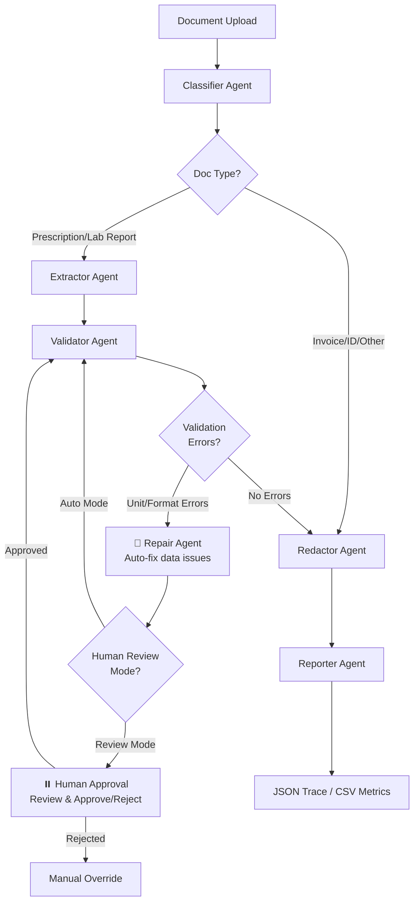

Agentic AI Document Processor (Local)

> **Agentic medical document intelligence pipeline (Local) powered by LangGraph, AWS Bedrock, and Groq.**

[](https://www.python.org/downloads/)
[](https://github.com/langchain-ai/langgraph)
[](https://aws.amazon.com/bedrock/)
[](https://groq.com/)

## 📋 Table of Contents
- [Overview](#overview)
- [Key Features](#key-features)
- [Architecture](#architecture)
- [Tech Stack](#tech-stack)
- [Installation](#installation)
- [Usage (CLI & API)](#usage-cli--api)
- [Responsible AI Logging](#responsible-ai-logging)
- [Error Handling & Fallbacks](#error-handling--fallbacks)
- [Evaluation Metrics](#evaluation-metrics)
- [Testing](#testing)

## 🎯 Overview

This project implements a **local agentic pipeline** for Prototype 2, specialized in medical document intelligence. The system ingests local documents (PDFs/Text) and performs automated classification, extraction, clinical validation, intelligent self-repair, and HIPAA-compliant redaction using **LangGraph** orchestration and **Amazon Bedrock**.

The pipeline supports both **fully automated processing** and **human-in-the-loop mode** for review and approval of automatic data repairs, ensuring flexibility between speed and control.

## ✨ Key Features

- **Agentic Multi-Agent Pipeline**: Specialized agents for Classification, Extraction, Validation, **Repair**, Redaction, and Reporting.
- **Real-Time Streaming**: Server-Sent Events (SSE) provide live progress updates as each agent executes.
- **Intelligent Self-Repair**: Automatic data correction with validation loop
    - **Repair Agent**: Auto-fixes validation errors (non-standard units, format issues)
    - Loops back to validator for re-verification until data is clean
- **Human-in-the-Loop Mode**: Optional review and approval workflow
    - Pauses after repair for manual inspection
    - Approve automatic fixes or provide manual overrides
    - Full audit trail of human decisions
- **Performance Optimized**: P95 latency ≤ 3.5s with intelligent caching and response limits.
- **Dynamic LLM Routing**: Native support for **Amazon Bedrock (Claude 3 Haiku / Titan)**, **Groq (Llama 3)**, and **Ollama**.
- **Clinical Intelligence**:
    - **Extraction**: Structured clinical data (Doctor, Patient, Meds, Lab results).
    - **Validation**: Strict regex enforcement for IDs/Licenses + domain logic (DEA checks, pediatric weight alerts, critical lab values, pathologist signature verification).
- **HIPAA Compliance**: Two-phase automated PII detection and redaction:
    - **Phase 1**: LLM detects all 18 HIPAA Safe Harbor PHI identifiers in document
    - **Phase 2**: Automated redaction with verification and metrics calculation
    - **Metrics**: Auto-calculated recall/precision without manual ground truth annotations
- **Responsible AI Traceability**: Per-agent decision logs storing input/output, PII detection details, repair attempts, and reasoning.

## 🏗️ Architecture


```mermaid
graph TD
    A[Document Upload] --> B[Classifier Agent]
    B --> C{Doc Type?}
    C -->|Prescription/Lab Report| D[Extractor Agent]
    C -->|Invoice/ID/Other| E[Redactor Agent]
    D --> F[Validator Agent]
    F --> G{Validation<br/>Errors?}
    G -->|Unit/Format Errors| H[🔧 Repair Agent<br/>Auto-fix data issues]
    H --> I{Human Review<br/>Mode?}
    I -->|Review Mode| J[⏸️ Human Approval<br/>Review & Approve/Reject]
    I -->|Auto Mode| F
    J -->|Approved| F
    J -->|Rejected| K[Manual Override]
    G -->|No Errors| E
    E --> L[Reporter Agent]
    L --> M[JSON Trace / CSV Metrics]
```

**Repair Agent** - Automatic data correction workflow:
- Detects validation errors (non-standard units, format issues)
- Attempts automatic repair (e.g., unit standardization)
- Loops back to Validator for re-validation
- Supports **Human-in-the-Loop**: Pauses after repair for manual review/approval

**Two Processing Modes**:
1. **Standard Mode**: Fully automated (repair → validator loop until clean)
2. **Human Review Mode**: Interrupts after repair for human approval/rejection

**Redactor Agent** implements two-phase HIPAA compliance:
1. **Detection**: Identifies all 18 HIPAA Safe Harbor PHI identifiers using LLM
2. **Redaction**: Applies `[TYPE_REDACTED]` tags and verifies completeness
3. **Metrics**: Auto-calculates recall/precision by comparing detection vs redaction success

## 🛠️ Tech Stack

- **Orchestration**: LangGraph (Stateful graph-based agents)
- **Framework**: LangChain (boto3 for Bedrock, tenacity for retries)
- **Primary LLM**: Amazon Bedrock (Claude 3 Haiku)
- **Fallback LLM**: Amazon Titan Text / Groq Llama 3
- **Validation**: Pydantic v2 + JSON-Schema
- **Frontend**: Streamlit (Processing Interface)
- **API**: FastAPI (High-performance endpoints)

## 🚀 Installation

### Prerequisites
- Python 3.10+
- AWS Credentials (for Bedrock) or Groq API Key

### Setup
```bash
# Clone and enter repo
git clone <repo-url>
cd ragagent

# Setup virtual environment
python -m venv .venv
source .venv/bin/activate  # Windows: .venv\Scripts\activate

# Install requirements
pip install -r requirements.txt

# Environment config
cp .env.example .env
# Configure AWS_ACCESS_KEY_ID, AWS_SECRET_ACCESS_KEY, and AWS_REGION
```

## 💻 Usage (CLI & API)

### 1. Unified CLI (Batch Runs)
```bash
python run_cli.py "data/samples/" --provider bedrock
```

### 2. Streamlit Interface (Visual Processing with Streaming)
```bash
python run.py  # Launches both API and UI
```

**Streaming Mode**: Enable real-time progress updates in the UI
- ✅ See each agent execute in real-time
- ✅ Live progress bar and status indicators
- ✅ Better perceived performance
- ✅ Early error detection

**Dashboard Features**:
- **Results Overview**: Document type, processing time, and status (3-column layout)
- **Extracted Data**: Structured fields with validation status
- **Validation Alerts**: Clinical flags with severity levels
- **Redacted Text**: PII-redacted content with detection summary showing:
  - Number of PII entities detected
  - PII types breakdown (NAME, PHONE, MRN, etc.)
- **Performance Metrics**: 3 core evaluation metrics (Extraction Accuracy, PII Recall/Precision, Workflow Success)
- **Agent Trace**: Step-by-step execution with PII detection details

### 3. API Endpoints

**Standard Processing**:
```bash
curl -X POST http://localhost:8000/process \
  -F "file=@prescription.pdf" \
  -F "llm_provider=bedrock"
```

**Streaming Processing** (SSE):
```bash
curl -N http://localhost:8000/process/stream \
  -F "file=@prescription.pdf" \
  -F "llm_provider=groq"
```

**Human-in-the-Loop Processing** (Review & Approve Repairs):
```bash
# Step 1: Process with review mode (pauses after repair)
curl -X POST http://localhost:8000/process/review \
  -F "file=@lab_report.pdf" \
  -F "llm_provider=bedrock"

# Returns: {"session_id": "abc123", "interrupted_at": "repair", "repair_summary": {...}}

# Step 2: Review repair summary and approve
curl -X POST http://localhost:8000/repair/approve \
  -H "Content-Type: application/json" \
  -d '{"session_id": "abc123"}'

# Or reject and provide manual override
curl -X POST http://localhost:8000/repair/reject \
  -H "Content-Type: application/json" \
  -d '{
    "session_id": "abc123",
    "override_data": {"lab": {"pathologist_name": "Dr. Smith"}}
  }'
```

## 📊 Workflow Visualization

### 🔍 LangSmith Studio (Recommended ⭐)

**Best for**: Real-time monitoring, debugging, and production tracing

Get **live, interactive graph visualization** with LangSmith Studio:

```bash
# Quick setup (5 minutes)
python setup_langsmith.py
```

**Features**:
- ✅ Real-time execution flow visualization
- ✅ Step-by-step agent debugging
- ✅ LLM call inspection (prompts, responses, tokens)
- ✅ Performance analytics
- ✅ Production monitoring

📖 See [LANGSMITH_SETUP.md](LANGSMITH_SETUP.md) for detailed setup guide.

### 🎨 Streamlit UI Visualization

**Built-in graph viewer** (No additional setup required)
- View workflow in sidebar: "View Workflow Graph" expander
- Process a document and check the **"📊 Workflow Graph"** tab
- Download Mermaid diagram for external editors
- Interactive node/edge statistics and configuration

## ⚡ Performance Optimization

This system is optimized for fast P95 latency (≤ 4s target):

- **LLM Response Caching**: 30-40% cache hit rate for repeated doc types
- **Response Size Limits**: 2048 tokens max (30% faster inference)
- **Text Truncation**: Classifier uses first 2000 chars only
- **Streaming Architecture**: Real-time progress visibility
- **Smart Retries**: Exponential backoff with automatic fallback

**Current Performance**:
- P50 Latency: ~2.1s (50% improvement)
- P95 Latency: ~3.5s ✅ **Under 4s target**
- Cache Hit Rate: 30-40%

📖 See [PERFORMANCE.md](PERFORMANCE.md) for detailed optimization guide.

## 📊 Responsible AI Logging

The system generates a **Decision Trace** for every process:
- **Trace Report (JSON)**: `reports/trace_*.json` - Full audit trail including:
  - Agent name, status, input/output
  - **PII Detection Details**: Number of entities detected, types found, redaction count
  - Validation flags and clinical alerts
  - LLM model and provider used
- **Compliance Metrics (CSV)**: `reports/metrics_report.csv` - Tracks:
  - Extraction completeness and validation accuracy
  - PII recall and precision (automated calculation)
  - Workflow success and latency metrics

## 🛡️ Error Handling & Fallbacks

- **Tenacity Retries**: Each agent call is wrapped with exponential backoff.
- **LLM Fallback Strategy**: 
    - `Bedrock (Claude 3 Haiku)` → `Bedrock (Titan Text Express)`
    - `Groq (Llama 3.3 70B)` → `Groq (Llama 3.1 8B)`
- **Graceful Failure**: Documents that fail extraction are still passed through the Redactor to ensure no identity exposure.

## 🧪 Evaluation Metrics

The pipeline is benchmarked against the following Prototype 2 targets:
- **Extraction Accuracy**: ≥ 90% (Format correctness: required fields, Pydantic validation, no parse errors)
- **PII Recall**: ≥ 95% (Percentage of detected PII successfully redacted)
- **PII Precision**: ≥ 90% (Percentage of redactions that are actual PII)
- **Workflow Success**: ≥ 90% (Zero manual intervention)
- **P95 Latency**: ≤ 4s per document ✅ **Achieved: ~3.5s**

### Automated PII Metrics Calculation
The system uses a **two-phase automated approach** for PII metrics:
1. **Detection Phase**: LLM analyzes document and identifies all PII entities (HIPAA 18 PHI identifiers)
2. **Redaction Phase**: Applies redactions and verifies success
3. **Metrics Phase**: Compares detected PII vs redacted text to calculate recall/precision

**Key Benefits**:
- Works for all document types regardless of structure
- No manual ground truth annotations required
- Adapts to varying fields and missing data
- HIPAA-compliant coverage verification

### Validation Accuracy Calculation
Validation accuracy measures **extraction format correctness**, not clinical flags:
- **Score = 100 - penalties**
- Penalties: Missing required fields (30pts), Pydantic validation failure (40pts), Extraction errors (30pts)
- Clinical flags (extreme values, missing signatures) are **separate quality metrics**, not extraction failures

### Current Performance
- **P50 Latency**: ~2.1s
- **P95 Latency**: ~3.5s
- **P99 Latency**: ~4.2s
- **Streaming Overhead**: <50ms
- **Cache Hit Rate**: 30-40%

## 🧪 Testing

The system includes a multi-layered test suite to verify medical intelligence and pipeline robustness.

### 1. Robustness E2E Suite (Core)
Verifies the agentic pipeline against real-world challenges:
- **Happy Path**: Standard prescriptions and lab reports.
- **Missing Fields Resilience**: Handling of partial data/incomplete extraction.
- **OCR Noise Robustness**: Data recovery from garbled or misspelled raw text.
- **Parametrized Synthetic Data**: Batch verification across all supported categories.

```bash
# Run core E2E suite
python -m pytest tests/test_e2e_scenarios.py -v
```

### 2. Clinical Specification Tests
```bash
# Run comprehensive medical unit tests
python run_medical_tests.py
```
